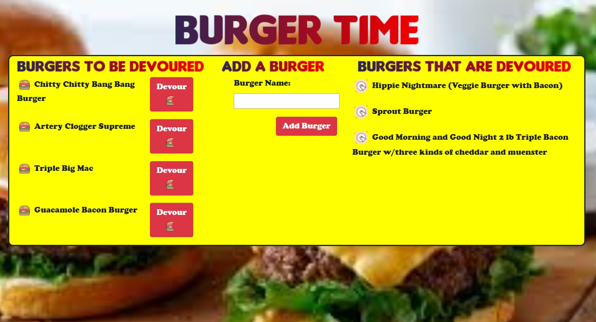

### Overview

Burger time is a Model View Controller application deployed to Heroku that allows users to view and create burgers they would like to devour.  The application uses a mySQL database and Object Relational Mapping to query the database.   Express is used to rout the client side and server side interaactions.  Handlebars then dynamically creates the page that users interact with.  

### Application Use

When the user comes to the page a list of all burgers will be displayed as either devoured on the right or to be devoured on the left.  If the user hits the "Devour" button next to one of the hamburger on the left "To be devoured", the burger will be devoured and will appear on the right.  The user may also add a burger they wish to devour.  

### [Link to app page](https://hidden-headland-99998.herokuapp.com/)